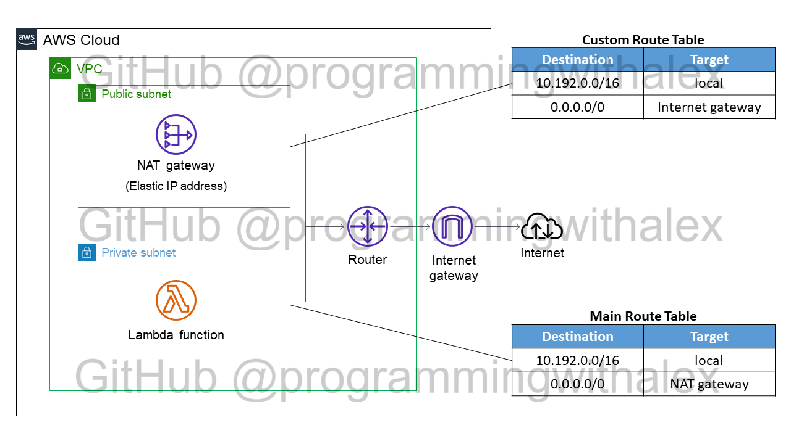

# aws_lambda_static_ip_demo

Copyright (c) 2021, https://github.com/programmingwithalex

This repo serves as a reference for the [YouTube playlist found here](https://www.youtube.com/watch?v=m4diiuHP-vM&list=PL0dOL8Z7pG3KSWxlDYibg0OyMb60BIHgr&index=1).

This video will cover end-to-end how to:

1. Manually create the AWS VPC and setting the AWS Lambda configuration to that VPC
2. Testing Lambda to verify the static outgoing IP
3. Automating creating the VPC with AWS Cloudformation and re-verifying the static outgoing IP

## License

[BSD 3-Clause License](https://github.com/programmingwithalex/aws-lambda-static-ip-demo/blob/main/LICENSE)
